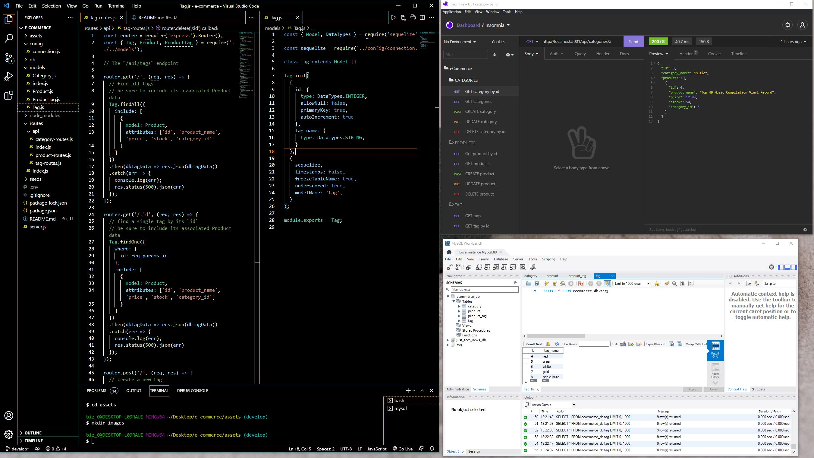

  # E-commerce Back End: ORM Challenge

  ## **Description**
  Using Sequelize to interact with a MySQL database, this back end code is built to house an online retailers database complete with sequelize models and api routes.

  ## **Images**
  
  
  ## **Table of Contents**
  
  * [Installation](#dependencies)
  * [Usage](#usage)
  * [Credits](#credits)
  * [License](#license)
  * [Features](#features)
  * [Languages](#languages)
  * [Technology](#technology)
  * [Tests](#tests)
  * [Contribute](#contribute)
  
  ## **Installation**
  npm install --save mysql2, npm i sequelize, npm install dotenv

  ## **Usage**
  Install all dependencies, create and fill out a .env file with your MySQL info. Open up a MySQL shell and type "SOURCE db/schema.sql" to load the database. Then, in the terminal, type "node seeds/index.js" to load all the seed data. Then, in the terminal, type 'npm start'. Lastly, go to your browser, or Insomnia, and type in "http://localhost:3001/api/" followed by the different routes available. MySQL Workbench is also a nice tool to use to view the database information.  

  ## **Credits**
  

  ## **License**
  
   
  
   

  ## **Features**
  https://drive.google.com/file/d/1vzsembCfplKCg50e32DFy88QJCQIkHWi/view

  ## **Languages**
  MySQL, Sequelize, JavaScript

  ## **Technology**
  https://www.npmjs.com/package/dotenv
  https://www.npmjs.com/package/sequelize https://www.npmjs.com/package/mysql2
  https://sequelize.org/master/index.html

  ## **Tests**
  No tests have been created for this application yet

  ## **Contribute**
  Find me on [GitHub](https://www.github.com/mattbisbee)
   
  Send me an [Email](mailto:aldhelm7@gmail.com)
   
  [Contributor Covenant](https://www.contributor-covenant.org/)
